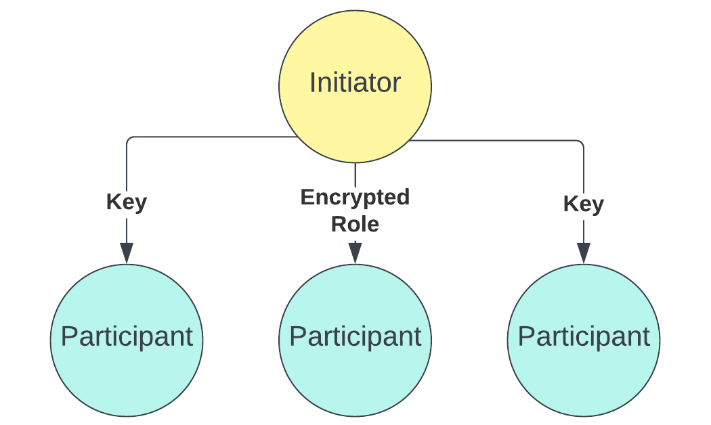
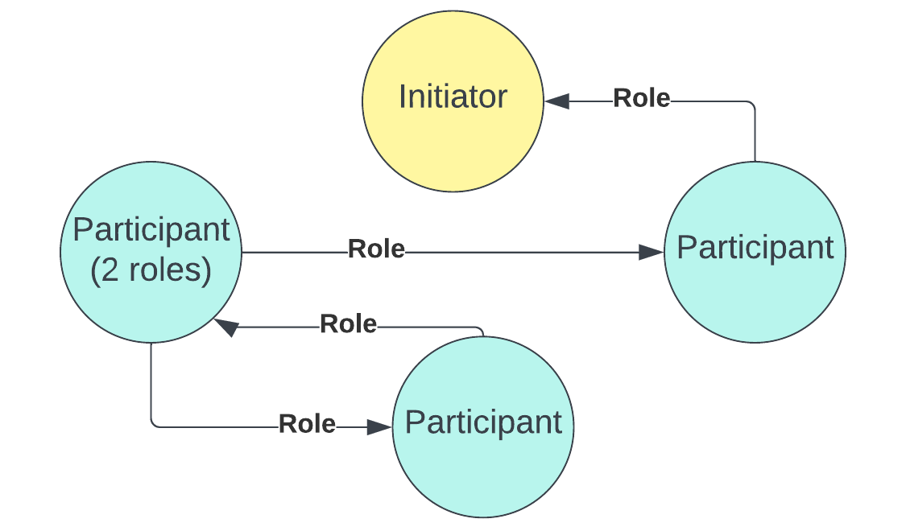
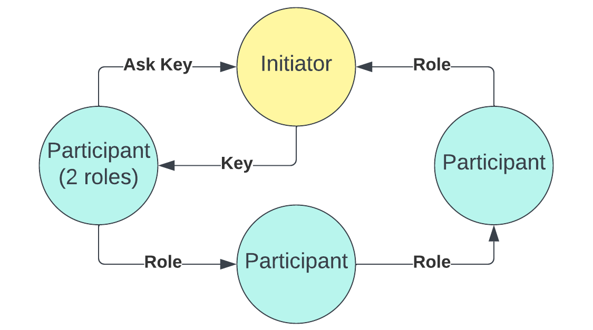

### The Initializer Logic
- Initiator initializes the game variables
- Participants ask to join to the game. If the game is not full, they will be accepted. Otherwise,  they will be rejected.
- When initializor thinks that they can start the game, they press the `Enter` button and initialization mechanism will be switched to stage 1.
- At stage 1, initiator will distribute encrypted roles to each player and the keys to all other players except the node who got the current role. After that, initializor will broadcast the end of stage 1.

- At stage 2, all other nodes will distribute the encrypted roles to each other. When they distribute the roles they have, they will wait until they receive a role and decrypt it. At that point, they will inform the initiator. When all nodes informed the initiator and initiator got a role, initiator will broadcast the end of stage 2 and the game will begin.

- In some cases, one player may not be able to receive a role and all other nodes would have received a role. At this point, that node can ask the initiator for the key of that role. Initiator will wait for 5 seconds before sending that key to prevent cheating.

### The Game Logic

- State: Day
    - Communicate
    - Select the saved ones
        - Update the protected list
- State: Night
    - Vampires target the ones they want to kill
        - Update the killed list
        - Update the saved list
- State: Voting
    - Update the killed list
- If not end
    - Publish the state update
    - cleanup 
    - set state to day
- If end
    - Broadcast the result

### Voting Logic
- You practically vote as is:
- Broadcasts: (voter, heard votes, simply a list is sufficient)
- Whispers: (peers, dictionary of (voter, whom they whispered of))